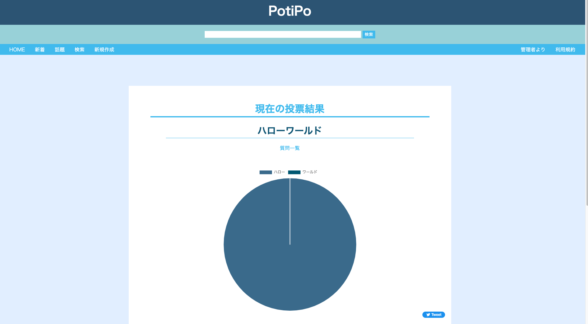

# potipo
## 概要
potipoは匿名投票ができるウェブアプリケーションです。<br>
質問作成、回答の追加、回答に対する理由の追加などを行えることが主な機能です。<br>
投票を終了すると結果を見ることができます。

## 前準備
### 1.環境変数を設定する
potipo/docker/フォルダ内に.envファイルを作成し、以下の内容を加える
```plainText
POTIPO_MYSQL_ROOT_PASSWORD=<MYSQLルートのパスワード>
POTIPO_MYSQL_USER=<MySQLユーザーのユーザー名>
POTIPO_MYSQL_PASSWORD=<MySQLユーザのパスワード>
```

### 2.変数を設定する
potipo/PotiPo/フォルダ内にsettings_local.pyを作成し、以下の内容を加える
```plainText
# Djangoの秘密キー
SECRET_KEY='<秘密鍵を設定する>'

# DB接続情報
DATABASES = {
    'default': {
        'ENGINE': 'django.db.backends.mysql',
        'NAME': 'django_db',
        'USER':'<MySQLユーザーのユーザー名>',
        'PASSWORD':'<MySQLユーザのパスワード>',
        'HOST':'localhost',
        'PORT':3306
    },
     'TEST': {
            'NAME': "test_django_db",
            'MIRROR': "default",
        },
}

```
秘密鍵については、後程生成するものを設定してください。
ユーザー名とパスワードには、環境変数に設定したものと同じものを基本的には設定してください。
<br>
<br>

## アプリケーションの起動
### 1. dockerフォルダに移動する
```sh
cd docker
```

### 2. コンテナを起動する
```sh
docker-compose up --build -d
```

### 3. コンテナ内に入る
```sh
docker exec -it potipo bash
```

### 4. 秘密鍵を生成する
```sh
python
>> from django.core.management.utils import get_random_secret_key  
>> get_random_secret_key()
　<生成された秘密鍵>
```
コンテナ内で上記のコマンドを実行することにより、秘密鍵が生成されます。<br>
それをコピーし、前準備：手順２で作成したsettings_local.pyに貼り付けてください。

### 5. コンテナ内でシェルコマンドを実行する
```sh
sh /home/init.sh
```
これにより、migrate、初期データの追加が行われます。

### 　6. アプリケーションの起動
```sh
python manage.py runserver
```
上記コマンドで、ポート8000番でアプリケーションが起動します。

もし、ポート8000番がすでに使用されている場合は以下コマンドで適宜変更してください
```sh
python manage.py runserver xxxxx
```
xxxxx にはポート番号を入れる

## 実行例
### 1. 初期画面


### 2. 質問の追加画面


### 3. 投票画面


### 4. 投票結果


### 5. 追加後のトップ画面


